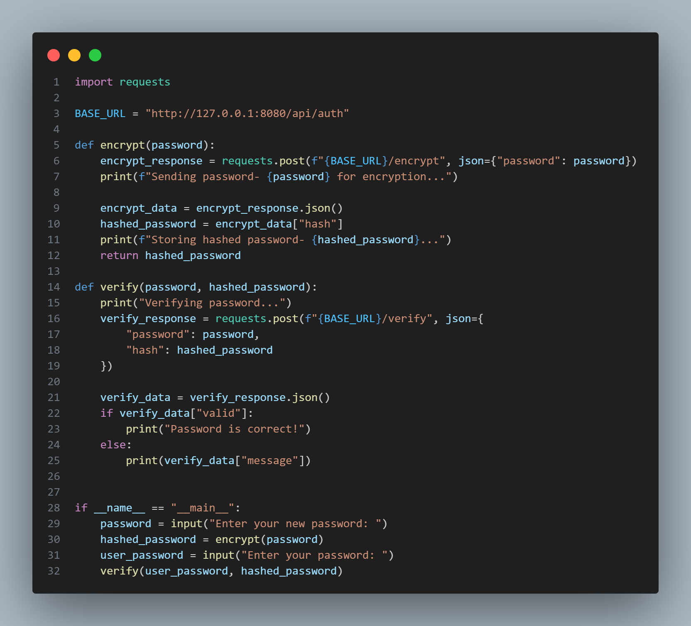
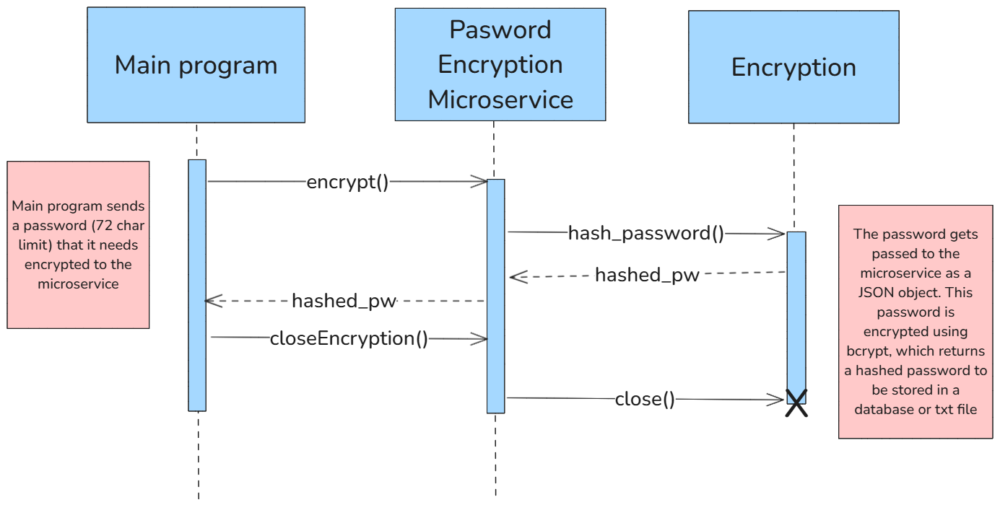
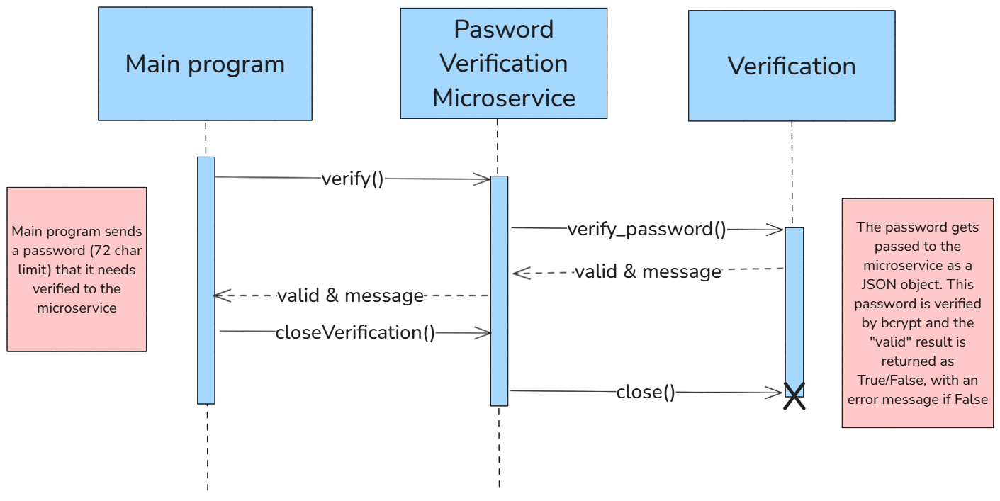

# Microservice A (Password Encryption/Verification) - Overview
Here are some preliminary notes:
- Hosted locally on port 8080
- May have to install relevant modules like bcrypt and flask.
- Communication method is REST API

The following will breakdown how to request data and receive data.
## Request Data
This is utilized when the client needs to: 
1. Encrypt a password that has been entered for storage
2. Verify (decrypt) that a password is valid

**Password Encryption-** The client request should look like this: {"password": "user-password"}

_Example:_ 
```python
    password = "test123"

    encrypt_response = requests.post("path-to-server", json={"password": password})
```

**Password Verification-** The client request should look like this: {"password": "password-to-verify", "hash": "stored-hash"}

_Example:_ 
```python
    password = "test123"

    hashed_password = "stored-hash"

    verify_response = requests.post("path-to-server", json= {"password": password, "hash": hashed_password})
```

## Receive Data
This contains the JSON package info sent back from the microservice server, depending on the request.

**Encryption Response-** The server response will look like this: {"hash": "hashed-password"}

_Example (REST API):_ 
```python
    password = “userpassword”

    encrypt_server = “localhost:5000/encrypt”

    response = requests.post(encrypt_server, password)

    if response == 200:

        data = response.json()

        hashed_password = data["hash"]

    else:

        return “Error response”
```


**Verification Response-** The server response will look like this: {"valid": True/False, "message": None/"error message"}

_Example (REST API):_
```python
    password = “userpassword”

    saved-hashpw = “savedhashpw”

    decrypt_server = “localhost:5000/decrypt”

    response = requests.post(decrypt_server, password, saved-hashpw)

    if response == 200:

        data = response.json()

        if data["valid"] == True:
            return True
        else:
            return data["message"]
    elif response == 400 or response == 500:
        return data["message"]
```

## Complete Sample Program


## UML Sequence Diagram
### Encryption UML


### Verification UML
